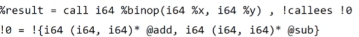
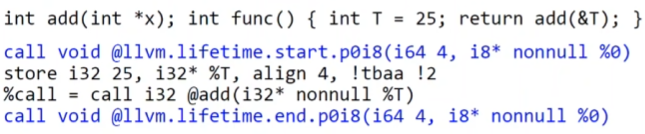

```llvm
define i32 @fib(i32) {
entry:
  %1 = icmp ult i32 %0, 2
  br i1 %1, label %final, label %st

st: ; main recursion entry
  %2 = add i32 %0, -1
  %3 = call i32 @fib(i32 %2)
  %4 = add i32 %0, -2
  %5 = call i32 @fib(i32 %4)
  %6 = add i32 %3, %5
  br label %final

final:
  %7 = phi i32 [%6, %st], [1, %entry]
  ret i32 %7
}
```

* метки
* глобальные символы
* локальные символы
* типы
* kw
* бб
* phi-узлы
* инструкции
* комметарии

Компиляторы могут именовать бб ближайшим свободным номером

Иденственное место, где появляется значение это инструкция

Значение <-> Инструкция

Любое значение имеет один тип

Типы:

* **Пустой тип:** `void`
* **Скалярные типы:** `i1`, `i8`, `i16`, ..., `half`, `float`, `double`
* **Векторные типы**`<10 x i32>`
* **Указатели:**`i32*`, `i32 addrspace(5)*`
* **Массивы:**`[10 x i32]`, `[12 x [10 x float]]`
* **Структуры:**`{i32, i16, i8}`
* **Функции:**`i32 (i32, i32)`

## Глобальная переменная

Это всегда указатель

## GEP

Инструкция вычисления адреса в агрегате. Основа модели памяти в llvm.

Одинаковый доступ к массивам и структурам

%res = getelementptr <ty\> \<ty\>* \<ptrval\> {, <ty\> <idx\>}*

Каждый индекс снимает уровень косвенности

Почти к каждому агрегату можно получить доступ только через указатель

Первый индекс в gep - 0 (тк указатель)

## Def - Use, User/Value

```llvm
%1 = add i64 0, 1 ; value
%2 = add i64 %1, %1 ; user, value
```

* Value знает обо всех своих User (Value::use_iterator)
* User знает обо всех своих операндах (User::op_iterator)
* User::getOperand(i) -> Value*

## Интрузивные списки

Каждая Instruction - нода интрузивного списка

## Расширение

Если надо что-то добавить, добавяется функция-интринсик.

## Функции

declare i8* @malloc(i32); объявление

call void asm sideeffect "mov ax, bx", ""(); call inline asm

%res = call i64 %binop(i64 %x, i64 %y); индиректный вызов

## Метаданные

* метаданные на инструкциях 
* Интринсики 

## Зависимость по анализу

Можно указывать зависимость по анализу
